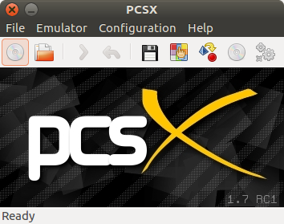
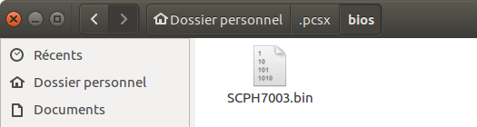
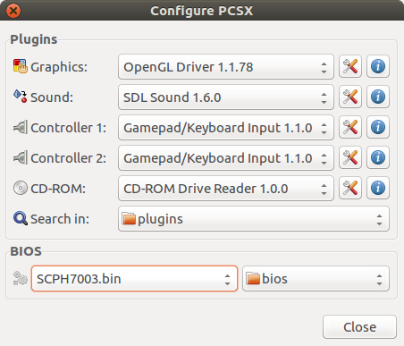
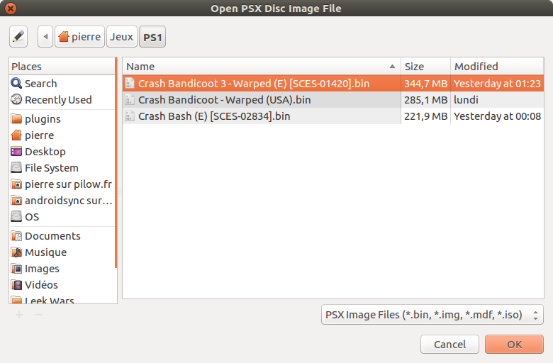
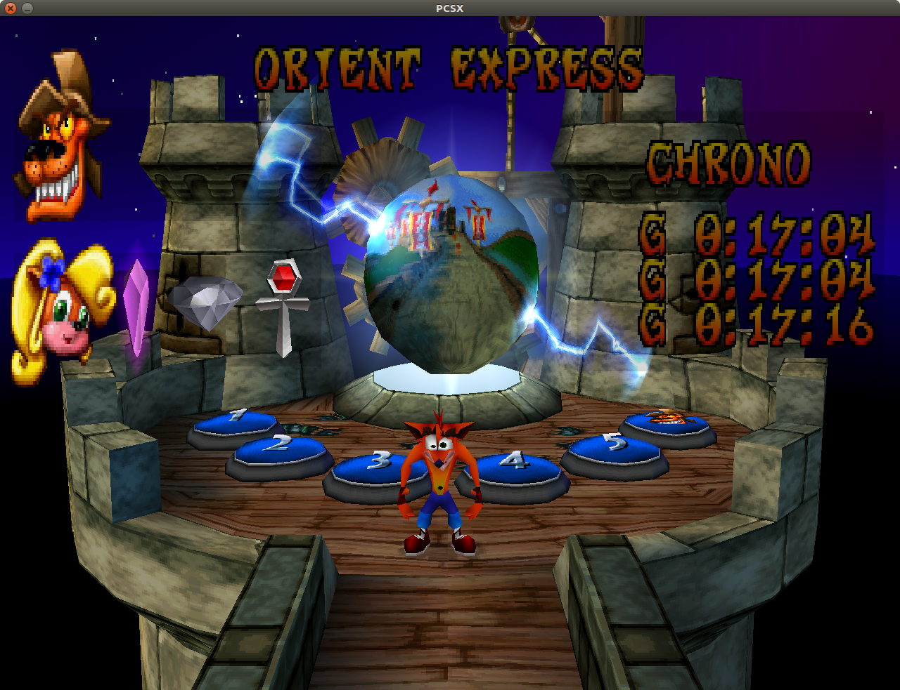
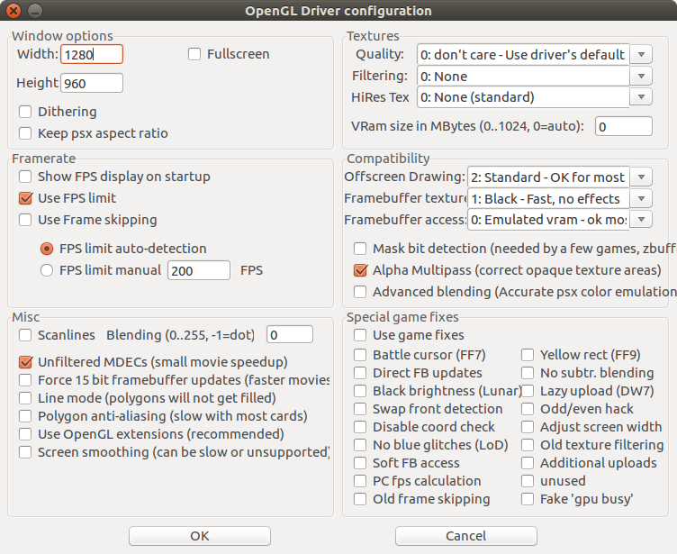
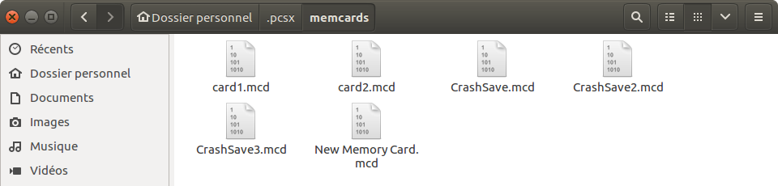
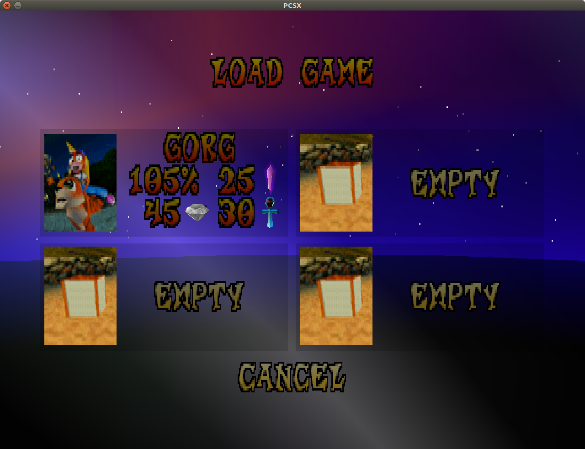

Aujourd'hui, j'ai eu envie de faire tourner quelques jeux PlayStation sur Linux.
J'avais déjà eu l'occasion de le faire depuis ma PSP, qui pouvait faire
fonctionner les jeux PlayStation nativement, mais jamais depuis un ordinateur, en particulier sur Linux.

Un des émulateurs PlayStation les plus populaires et les plus performants sur Linux
est [PCSX Reloaded](http://pcsxr.codeplex.com/), qui est une amélioration de PCSX. Il est libre (license GPL),
écrit en C depuis 2000, puis repris en 2009.

## Téléchargement

Sur [le site officiel de PCSX](http://pcsxr.codeplex.com/), ou bien directement sur [la logithèque Ubuntu](http://apt.ubuntu.com/p/pcsxr).

Lancement et configuration
--------------------------
Au lancement de PCSX, on arrive sur une interface très simple :

Page d'accueil de PCSX

### Configuration du bios
Pour faire fonctionner l'émulateur, il est préférable de disposer d'une image d'un bios original de la PlayStation.
PCSX peut, grâce à son émulation HLE (High Level Emulation), se passer de ce bios, mais l'avoir
augmente tout de même la compatibilité. Pour récupérer une image de bios PlayStation, vous pouvez la dumper de votre console, ou bien rechercher directement sur Internet les mots-clés "*SCPH7003.bin*", "*SCPH1001.bin*" ou encore "*SCPH7502.bin*".

L'image du bios est à mettre dans le dossier `~/.pcsx/bios` :

Ensuite, allez dans `Configuration` > `Plugins & BIOS...` et sélectionner le bon fichier :

### Lancement d'un jeu

PCSX supporte des images de jeux PlayStation au format `.bin`, `.img`, `.mdf`, `.iso`.
Pour en obtenir, recherchez sur Internet comment dumper vos jeux dans le format que vous souhaitez.

Une fois avoir obtenu l'image de votre jeu, allez dans `File` > `Run ISO...` et sélectionnez le bon fichier (ici au format `.bin`) :

Si tout se passe bien le jeu démarre :

## Configuration
La fenêtre de la configuration graphique est bien fournie :

Gestion des sauvegardes
-----------------------
PCSX possède un gestionnaire de sauvegardes très intéressant. Il permet
de gérer une infinité de cartes mémoires, et de manipuler les sauvegardes
de jeu présentes dessus. Chaque carte mémoire est représentée par un fichier
`.mcd`, qui est stocké par défaut dans `~/.pcsx/memcards`.

Ayant déjà joué à deux jeux PlayStation sur PSP, je possède de sauvegardes de jeu
au format `.vmp`, propre à la PSP. Il est possible de convertir les fichiers
`.vmp` vers des fichiers `.mcd`, avec un outil comme [Memory Converter](http://www.aldostools.org/memcards.html).

J'ai donc pu récupérer ma sauvegarde de **Crash Bandicoot 3** à 105% réalisée quelques années avant sur PSP :

Bilan
-----

Points positifs
- Gestionnaire de sauvegarde
- Beaucoup de jeux compatibles
- Très rapide et léger en ressources
- Compatible avec une manette

Points négatifs
- Choix de la résolution pas assez souple
- Quand un jeu est lancé, il est impossible de changer les paramètres
(résolution, contrôles, ...)

Bonus
-----
Niveau réalisé sur l'émulateur (j'ai raté la capture du son mais il est bien présent en jeu) :
<iframe width="560" height="315" src="https://www.youtube.com/embed/CWPQp3rXmZ8" frameborder="0" allowfullscreen></iframe>

Références
----------
- [Site du project PCSX Reloaded](http://pcsxr.codeplex.com/)
- [Page Wikipédia de l'émulateur PCSX Reloaded](https://en.wikipedia.org/wiki/PCSX-Reloaded)
- [Documentation de PCSX Realoaded sur ubuntu-fr.org](https://doc.ubuntu-fr.org/pcsx-reloaded)
- [Site de Memory Converter](http://www.aldostools.org/memcards.html)
